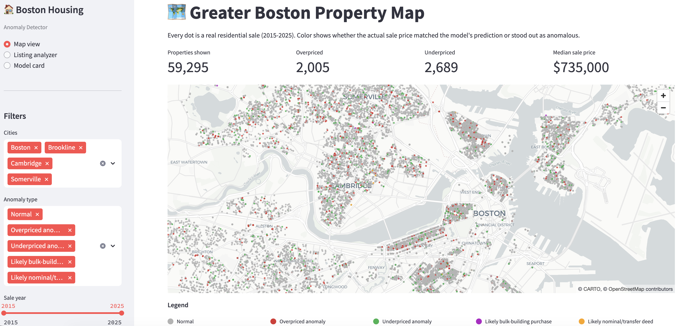

# Boston Housing Anomaly Detector

> A LightGBM model that flags over- and under-priced residential listings across Greater Boston using only public data, with SHAP explanations for every prediction.

[**Live demo →**](https://huggingface.co/spaces/aryanya99/boston-housing-anomaly)



## What this is

A model that predicts what a residential property *should* sell for in Greater Boston, compares it to what it actually sold for, and flags outliers. Trained on ~50K historical sales from MassGIS assessor records (2015–2025) plus MBTA station locations. No private data, no MLS access, no inspection records.

The interesting part isn't the prediction. It's that during anomaly investigation, the residual distribution surfaced two distinct categories of municipal data quality issues that are usually invisible: family transfers / nominal-consideration deeds, and bulk building purchases recorded against individual condo units. Both are explicitly flagged in the live demo.

## Performance

On the held-out Boston test set (6,482 sales, 2021–2022):

| Model                  | MAPE      | R²       |
| ---------------------- | --------- | -------- |
| Mean baseline          | 41.4%     | -0.15    |
| Linear regression      | 27.6%     | -0.07    |
| **LightGBM**           | **15.2%** | **0.83** |
| Boston city assessor   | 15.2%     | 0.80     |

The model **matches the City of Boston's tax assessor on Boston test MAPE** while explaining 4 percentage points more of the variance — using only data anyone can download.

## How it works

The pipeline runs in six stages, each saved as a parquet file so any stage can be re-run independently:

1. **Ingest** four MassGIS L3 shapefiles (Boston, Cambridge, Somerville, Brookline). Each city's data is on a different fiscal-year vintage; assessor `USE_CODE` formatting changed between vintages and is harmonized.
2. **Clean** to residential sales only, with a price-per-square-foot floor that catches sub-market transactions the absolute price floor misses.
3. **Geocode** every property by joining to its parcel polygon and computing a centroid in Massachusetts State Plane (EPSG:26986), then reprojecting to WGS84.
4. **Engineer features** — distance to nearest MBTA rapid transit station via spherical-coordinate KDTree, and neighborhood median price-per-sqft within 800m. The neighborhood feature uses *only sales prior to* each row's sale date, so there's no temporal leakage.
5. **Train** LightGBM with per-city time-aware splits (most recent 15% per city held out as test) and a calibration shift to recenter residuals.
6. **Score and explain** every property with SHAP TreeExplainer; classify residuals into normal / over- / under-priced / bulk-sale / nominal-deed.

## Key design decisions

**Per-city time-aware split.** Each city's data has a different vintage (Boston ends 2022, Cambridge goes to 2025). A single global cutoff would leave Boston out of the test set. Per-city splits give every city test coverage and force the model to extrapolate to unseen sales it didn't train on.

**`TOTAL_VAL` excluded as a feature.** The assessor's own valuation is a strong predictor — using it as input would mean the model just learns "trust the assessor." Used only as a benchmark to compare against. This is a deliberate hit to headline metrics in exchange for a defensible model.

**Calibration shift.** After training, the median log-residual on the train set is added to all predictions. Without this, anomaly thresholds derived from residual z-scores are asymmetric (too few "overpriced" flags relative to "underpriced").

**Centroids computed in projected CRS.** Centroid math on raw lat/long is geometrically wrong because lat/long isn't a flat plane. Centroids are computed in MA State Plane (meters), then the resulting points are reprojected to WGS84.

## What I found in the data

**Use code format changed between MassGIS vintages.** FY2023 data uses 3-digit codes with a leading zero (`0101` for single-family); FY2025/FY2026 data uses 4-digit codes ending in zero (`1010`). Without harmonization, residential-only filters drop 99% of recent-vintage rows.

**Sub-market transactions cluster at round numbers.** A `$50,000` sale price appears far more often than its surrounding distribution would predict. These are nominal-consideration deeds (transfers between family members, trusts, LLCs) misregistered as arms-length sales. Filtered with a `$/sqft` floor.

**Bulk building purchases produce phantom "overpriced" units.** When an investor buys an entire 12-unit building for $6.2M, the assessor's database records the sale against each individual condo, making it look like 12 separate ~$600 sqft units sold for $6.2M each. Detected post-hoc by flagging price ratios above 3×.

## Honest limitations

- **Top-decile underprediction.** Properties above $1.8M are systematically underpredicted by 7–15%. The model can't see interior finish quality, views, or bespoke architectural details that drive luxury premiums.
- **Temporal regime shift.** MAPE rises from ~13% in 2019–2021 to ~17–20% in 2024–2025. The model can't fully extrapolate post-2022 price changes; in production this would require quarterly retraining.
- **Mild residual asymmetry.** After calibration, 51–56% of sales fall above predictions across cities. Anomaly thresholds modestly over-flag overpriced cases and under-flag underpriced ones.
- **Somerville test sample is unrepresentative** (n=897, R² 0.47) — its FY2025 vintage skews recent transactions toward 2- and 3-family multis and away from the condo-heavy training distribution.

## Repository structure

```
boston-housing-anomaly/
├── app/streamlit_app.py        # The deployed UI
├── data/                        # Raw inputs (gitignored), processed parquets
├── models/                      # Trained model + calibration + metrics
├── notebooks/                   # EDA + diagnostic notebooks
├── scripts/                     # Pipeline stages, run in order:
│   ├── build_clean_dataset.py
│   ├── add_geocoordinates.py
│   ├── build_spatial_features.py
│   ├── train_model.py
│   ├── score_and_explain.py
│   └── refine_anomaly_flags.py
├── deploy/                      # HF Spaces deployment (slimmed runtime)
└── requirements.txt
```

## Run it locally

```bash
# 1. Clone and set up
git clone https://github.com/yaryan/boston-housing-anomaly.git
cd boston-housing-anomaly
uv venv --python 3.11 && source .venv/bin/activate
uv pip install -r requirements.txt

# 2. Download the four MassGIS L3 shapefiles to data/raw/assessor/
#    (Boston M035, Cambridge M049, Somerville M274, Brookline M046 from
#     mass.gov/info-details/massgis-data-property-tax-parcels)

# 3. Download MBTA GTFS stops.txt to data/external/

# 4. Run the pipeline (~20 minutes total)
python scripts/build_clean_dataset.py
python scripts/add_geocoordinates.py
python scripts/build_spatial_features.py
python scripts/train_model.py
python scripts/score_and_explain.py
python scripts/refine_anomaly_flags.py

# 5. Launch the UI
streamlit run app/streamlit_app.py
```

## Tech stack

Python 3.11 · pandas · DuckDB · geopandas · LightGBM · scikit-learn · SHAP · Streamlit · pydeck · Plotly · MassGIS L3 Standardized Parcels · MBTA GTFS

## Author

**Yashaswi Aryan** — MS Data Science, Northeastern University.
Currently looking for summer 2026 data science / analytics internship roles in the Boston area.

[LinkedIn](https://www.linkedin.com/in/yaryan99) · [GitHub](https://github.com/yaryan) · [yaryan99@gmail.com](mailto:yaryan99@gmail.com)